#**Kilobot**

###**My First Robot in ROS2**
 

###### Autore: Claudio Freddi

## Introduzione

Questo documento ha lo scopo di sintetizzare: 
- Le attività svolte 
- I riferimenti a link nel web che ho trovato molto utili
- I problemi che ho riscontrato e le soluzione
- Riferimenti a shortcut per svolgere attività banali


### List of Contents
##### [1. Ambiente Operativo](#1-Ambiente-Operativo)
##### [2. Hardware necessario](#1-Hardware-Necessario)
##### [3. Installazione Software Base](#3.-Installazione-Software-Base)
##### [4. Setup Robot](#4-Setup-Robot)

##### [99. Useful Commands](#99-Useful-Commands)


## 1. Ambiente Operativo

### Mini PC 
#####Nome: RobotDev
#####IP: 192.168.8.200 
#####User: claudio
Questo è il PC principale da cui si sviluppa e si controllano gli altri elementi dell'architettura.


### Raspberry Pi 4 B+  (RobotRPi) 
#####Nome: RobotRPI
#####IP: 192.168.8.201
#####user: claudio
Questo è il cervello principale a bordo di __Kilobot__ che svolge le funzioni autonome.

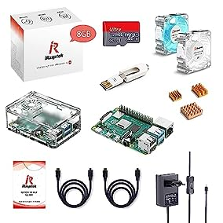

### Wifi Router 
#####Nome: RobotLAN
Il router è utile per creare una rete separata con IP fissi così da conoscere perfettamente come raggiungere una risorsa.

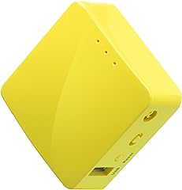

GL.iNET GL-MT300N-V2 (Mango) Mini portabile router da viaggio VPN, Mobile Hotspot in tasca, ripetitore bridge, range extender, OpenVPN Client, 300Mbps Wireless ad alte prestazioni, 128MB RAM

### Arduino 
Questo è l'attuatore principale dei motori perchè come microprocessore è in grado di conrtollare con più precisione alcuni aspetti.

KEYESTUDIO MEGA R3 2560 Plus Controller Board per Arduino IDE cavo USB compatibile
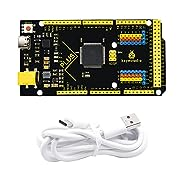

KEYESTUDIO Mega 2560 R3 Sensor Shield Scheda di espansione per Arduino Mega R3 Kit
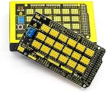

### Zoho Assist 


Questo Software permette di connettersi al Mini PC da remoto per una gestione da out of office.

 https://www.zoho.com/assist/

Servizio "__Unattened Remote Access__" (a pagamento, 120 Euro/anno fino a 25 unattended computers )

## 2. Hardware Necessario 

In aggiunta a Mini PC, Raspberry , Arduino si elencano gli altri componenti utilizzati nella costruzione del robot

### Yahboom ROS Expansion Board 

For Raspberry Pi Jetson Nano Robot Development Board UNO R3 Electronics Project DIY With ROS1&ROS2 (ROS Expansion Board)

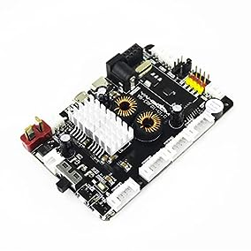

### Lidar
Innomaker Lidar Radar incorporato DTOF 360 gradi di scansione omnidirezionale 25000 Lux Resistenza TOF Tempo di volo (LiDAR_LD19) Supporto ROS/ROS2


### Braccio Meccanico

Taidda- Braccio Meccanico, 6DOF Robot Kit Braccio Meccanico Claw Kit Artiglio Manipolatore DOF Robot Industriale Parti per insegnamento Universitario


### Powerbank

AXNEB Power Bank Wireless __25W PD3.0+QC4.0, 26800mah__ Caricatore Portatile Wireless 15W Ricarica Rapida con 4 Uscite Caricabatterie per iPhone 13 12 11


### RPi GPIO Scheda di espansione
ARCELI RPi GPIO Scheda di espansione Breakout + Cavo a Nastro + Adattatore T Tipo GPIO assemblato 20 cm FC40 Cavo Piatto a Nastro 40pin per Raspberry

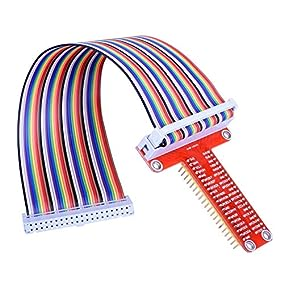

### DC-DC USB Buck Converter Step-Down Module 6-32V 12V 24V a 5V QC 3.0
Youmile 5PCS DC-DC USB Buck Converter Step-Down Module 6-32V 12V 24V a 5V QC 3.0 Modulo di ricarica Regolatore di tensione Modulo di alimentazione con
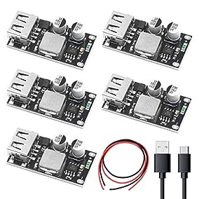

### UPC Batteria Step Up Charger Board 15W (9V)
HEEPDD Batteria Step Up Charger Board, 15W 3A Batteria Al Litio Ricarica Modulo Boost Circuito UPS Ad Alta Efficienza per Dispositivo Elettrico (9v)


### Pannello solare (13 W 5 V)
Andoer Caricatore solare 13 W 5 V pannello solare con doppia porta USB cella solare in silicio policristallino per attivit� all'aperto campeggio

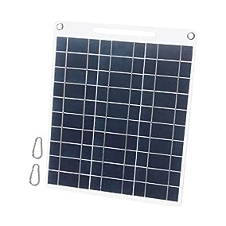


### Scheda Driver H-bridge
Aatpuss 3 Pezzi Scheda Driver H-bridge, Modulo Driver Motore L298N, L298N Modulo H scheda Driver Bridge, per robot per Auto Intelligente Con Motore Passo-Passo

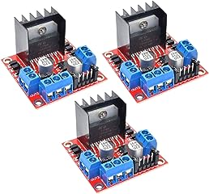

### Monitor Touchscreen Portatile da 7 pollici Raspberry Pi
Beumons Monitor Touchscreen Portatile da 7 pollici Raspberry Pi,IPS da 1024X600 con monitor HDMI USB Capacitivo Pi,Compatibile con Raspberry Pi 3b+/Ra


### Tastiera Bluetooth
Logitech K380 Tastiera Bluetooth Multidispositivo per Windows, Apple iOS, ?Bluetooth Wireless, Design Compatto, PC/Mac/Laptop/Smartphone/Tablet, Layou


### Kit Ruote 25GA370
Kit ruote da 65 mm Motore con albero da 4 mm, motore elettrico 25GA370, mini stampante per auto per robot per auto giocattolo intelligente

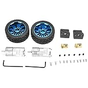

### Telecamera Modulo Telecamera (Raspberry)
KEYESTUDIO Raspberry Pi Telecamera Modulo Telecamera 5mp Sensore 1080p per Raspberry Pi 4 Modello A,B, B +, Modello 2, Zero
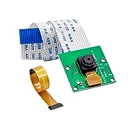

### Modulo Relay 5V a 2 canali
AZDelivery 3 x Modulo Relay 5V a 2 canali con optoaccoppiatore Low-Level-Trigger compatibile con Arduino incluso un E-Book!
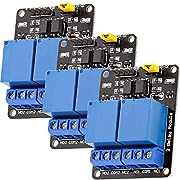

### BATTERIA 12V 10000mAh 10Ah RICARICABILE
AFTERTECH PACCO BATTERIA PILA 12V 10000mAh 10Ah RICARICABILE AL LITIO 120x65x31mm F2D5
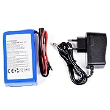

## 3. Installazione-Software-Base


### OS Ubuntu su Mini PC !

Installa __Ubuntu (22.04 LTS)__ con Dual Boot su PC Windows 11

 https://www.freecodecamp.org/news/how-to-dual-boot-windows-10-and-ubuntu-linux-dual-booting-tutorial/

Installa __ROS2 Humble__ 

 https://docs.ros.org/en/humble/Installation/Ubuntu-Install-Debians.html

### OS Ubuntu su Raspberry Pi 4 B+  (RobotRPi)

Installa __Ubuntu (22.04 LTS)__ on Raspberry Pi

 https://roboticsbackend.com/install-ubuntu-on-raspberry-pi-without-monitor/

Installa __ROS2 Humble__ on Raspberry Pi

 https://roboticsbackend.com/install-ros2-on-raspberry-pi/


### Software Generico (per Ubuntu di utilità)

#### Installa IPScan

Download da sitoweb  IPScan 
    
 https://angryip.org/download/#linux

poi installare dalla cartella Dowload 

    sudo apt install /download/ipscan_2.9.1_amd64.deb

#### Installa Tilix (Multi Terminal Application)

    sudo apt-get install -y tilix 


#### Installa Zoho (Remote access)

Da piattaforma zoho 

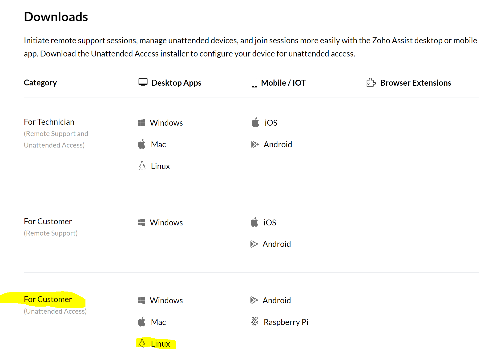


##### Per abilitare il Remote Access in Linux (Zoho Unattended)
Per abilitare l'accesso remoto al software Linux: 

1. Open the file __/etc/gdm/custom.conf__ in a text editor
2. __Un-comment the line: "#WaylandEnable=false"__ (remove the # before the line)
3. Save the file and reboot the machine

Per abilitare l'accesso remoto al software Linux: 

    sudo apt install openssh-server # Install

    sudo systemctl status ssh       # Check Status

    sudo ufw allow ssh              #  Enable


#### Installa GitHub 

E' importante usare il repository di GitHub perchè permette di gestire le versioni di codice e condividere lo stesso codice tra la macchina RobotDev e RobotRp

__Installazione__

    sudo apt install git

__Configurazione__

    git config --global user.name claudiofreddi
    git config --global user.email git@claudiofreddi
    git config --global push.default simple

__Repositories__

__Main Code (Min PC e Raspberry)__

 https://github.com/claudiofreddi/kilobot

__Ardiuno Code__

 https://github.com/claudiofreddi/kilobot_arduino


__Working Folder__

__Min PC__

    ~/dev_ws/src/kilobot
    ~/robot_arduino/kilobot_arduino

__Raspberry__

    ~/robot_ws/src/kilobot
    ~/robot_arduino/kilobot_arduino

###### Installa GitHub

Link di riepilogo dei comandi PULL e PUSH utile

    http://www.allafinedelpalo.it/git-1-introduzione-add-commit-push-pull/

### Software per ROS2 (Humble)

### Install Xacro e joint-state-publisher-gui

    sudo apt install ros-humble-xacro ros-humble-joint-state-publisher-gui

### Install Tf2 tools and Transformation

Questi sono importanti per interfacciarsi con rViz2

    sudo apt-get install ros-humble-tf2-tools ros-humble-tf-transformations

    ros2 run tf2_tools view_frames  #Check it


### RViz2

Questo tool permette di vedere la struttura del robot.
Il lancio di Rviz2 deve essere preceduto da 
    
    robot_state_publisher           # aspetto statico del robot
    joint_state_publisher_gui       # aspetto dinamico del robot
    rviz2                           # rviz2

il lancio lo su può fare con il comando

    ros2 launch kilobot rsp.launch.py  # lancia la sequenza

Utilizza i dati della cartella "\Description\\*.xacro" dei file xacro.


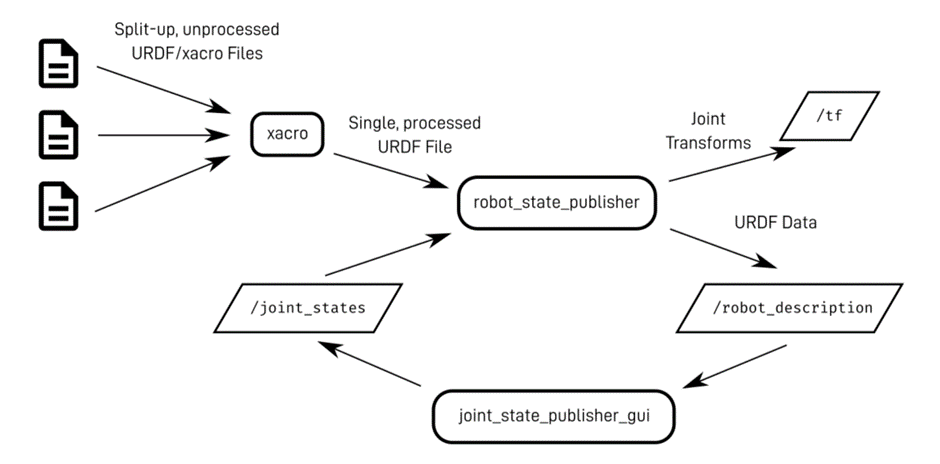


### Turtlesim

Per eseguire la Turtlesimo lanciare

    ros2 run turtlesim turtlesim_node

### Joystick

Per attivare il Joystick lanciare
 
    ros2 run launch kilobot joystick.launch.py
    
che esegue 

    ros2 joy joy_node # with params
    ros2 teleop_twist_joy teleop_node # with params and remap '/cmd_vel' => '/turtle1/cmd_vel0


controllo con

    ros2  topic echo __/turtle1/cmd_vel__       # esito del topic

    ros2 run joy joy_enumarate_devices          # elenco device e ID controller (es. 0)


### GAZEBO

Per installazione 

    sudo apt install ros-humble-gazebo-ros-pkgs

Esecuzione

    ros2 run gazebo_ros spawn_entity.py -topic robot_description -entity some_name
    
    ros2 launch gazebo_ros gazebo.launch.py world:=src/robot_testing/worlds/world6.world


<!-- Analizzare -->


### Joystick Driver
Per l'installazione del joystick ho trovato qualche difficoltà con il joystick della __XBOX One__ finchè non ho trovato questo link utilissimo.

 https://atar-axis.github.io/xpadneo/

Estratto solo per __XBox One__

#####Prerequisites

Make sure you have installed dkms, linux headers and a bluetooth implementation (e.g. bluez) and their dependencies.

On __Debian__ based systems (like Ubuntu) you can install those packages by running 

```sh
sudo apt-get install dkms linux-headers-`uname -r`
```

#####Installation

Download the Repository to your local machine 

    git clone https://github.com/atar-axis/xpadneo.git
    cd xpadneo

run 
    
    sudo ./install.sh


##### Connection

    sudo bluetoothctl
    [bluetooth]# scan on

wait until all available devices are listed (otherwise it may be hard to identify which one is the gamepad) push the connect button on upper side of the gamepad, and hold it down until the light starts flashing fast
wait for the gamepad to show up in bluetoothctl, remember the address (e.g. `C8:3F:26:XX:XX:XX`)

    [bluetooth]# scan off to stop scanning as it may interfere with properly pairing the controller
    [bluetooth]# pair <MAC>
    [bluetooth]# trust <MAC>
    [bluetooth]# connect <MAC> (should usually not be needed but there are open bugs)

The < MAC > parameter is optional if the command line already shows the controller name


##### Configuration

Use 
    
    sudo ./configure.sh 
    
to configure the driver as you wish. The script will guide you through the available options.

##### Update

In order to update xpadneo, do the following

Update your cloned repo: 
    
    git pull
    
Run

    sudo ./update.sh


##### Uninstallation

Run 

    sudo ./uninstall.sh 

to remove all installed versions of hid-xpadneo.


### Joystick Configuration

Per la configurazione ed utilizzo del Joystick ho trovato molto utile questo link

https://articulatedrobotics.xyz/mobile-robot-14a-teleop/

To check our gamepad works in Linux, we want to install some useful tools:

    sudo apt install joystick jstest-gtk evtest

With the controller connected (e.g. via USB or Bluetooth), we can open a terminal and run evtest. 


In ROS2 to check available controllers, run 

    ros2 run joy joy_enumerate_devices

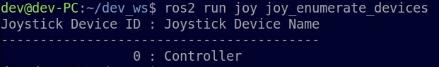
    
    ros2 run joy joy_node # <-- Run in first terminal (running the node)
    ros2 topic echo /joy # <-- Run in second terminal (displaying the outputs)


## 3. Setup Robot


## 97. Code Links

#### ROS Arduino Bridge  (Josh Newans)
Questa implementazione abilita Arduino 

 https://github.com/joshnewans/ros_arduino_bridge/tree/main/ROSArduinoBridge

#### ROS Arduino Bridge  (Original - HomeBrew Robotics Club) 

 https://github.com/hbrobotics/ros_arduino_bridge

#### PySerial (Serial comunicartion Python)
This module encapsulates the access for the serial port. It provides backends for Python running on Windows, OSX, Linux, BSD (possibly any POSIX compliant system) and IronPython. The module named "serial" automatically selects the appropriate backend.

 https://github.com/pyserial/pyserial/tree/master


#### YAHBOOM Robot Shield

    http://www.yahboom.net/study/ROS-Driver-Board


## 98. Useful Tutorial Links (How To)

#### ROS2 Humble Documentation
 https://docs.ros.org/en/humble/

#### ROS2 Tutorial (Josh Newans)
Utilissimo sia per la costruzione del robot che per la parte teorica

https://articulatedrobotics.xyz

#### GitHub Basics

http://www.allafinedelpalo.it/git-1-introduzione-add-commit-push-pull/

#### Flash Arduino da Raspberry da remoto (Josh Newans) 
Spiega come caricare del software su Arduino da remoto, ovvero connettendosi con Visual Studio dalla macchina RobotDev a RobotRPI a cui è connesso Arduino con USB seriale

 https://www.youtube.com/watch?v=2BJ-iJF04VA&list=RDCMUCx9vSJTSZGFrErfPtut5GNQ&index=21

#### Connessione Raspberry e Arduino (modalità possibili)
How to Connect and Interface a Raspberry Pi With an Arduino ?

 https://rishabhdevyadav.medium.com/how-to-connect-and-interface-a-raspberry-pi-with-an-arduino-4153e3c09e7c


#### The Ultimate Guide to using Motors in Robotics (including ROS, Raspberry Pi) - Connect Motor Shield 

 https://www.youtube.com/watch?v=-PCuDnpgiew


## 99. Useful Commands

**Connessione a RoborRPI** 

    ssh claudio@192.168.8.201 

**TEST LINSTENER and TALKER** 

Per verificare se il sistema funzione

    ros2 run demo_nodes_py listener

    ros2 run demo_nodes_py talker

##### Run RViz2

    ros2 launch kilobot rsp.launch.py


**JOYSTICK** check available controllers

    ros2 run joy joy_enumerate_devices

    
##### Run Joystick

Connect Joystick

    ros2 launch kilobot joystick.launch.py

    ros2 run turtlesim turtlesim_node

    


**Compile Code** 

    colcon build --symlink-install 


#SAMPLE

**Nested HTML**

<iframe src="./html/res_Codifica_Nuovi_Clienti.html"

height="500px" width="1000px"></iframe>
[Simple Link to HTML](./file.html)

**Image sized**


**Nested SQL with height**

<div style="height: 200px; overflow: auto">

```sql
```
</div>

**SQL**

```sql
```

<span style="color:gray"><b>JSON Risorsa</b></span></br>

<a target="_blank" href="/jsonfilename.json" download="filename.json">Download</a> 
</br>


<span style="color:gray"><b>Gray Title</b></span></br>

___Bold And Underlined___


**Table**
Col 1 | Col 2
------------ | -------------
 Val 1 | Val 2
 Val 1 | Val 2
 Val 1 | Val 2


